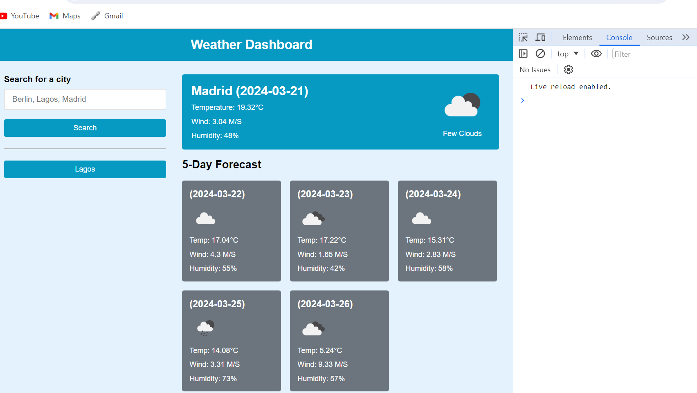

# Console-Finance-Challenge
The purpose is to create a weather dashboard using another application API to retrieve data on the app using HTML, CSS and Javascript to dynamically update the browser and dashboard when prompted with the search queries.

## Table of Contents

* Box for city search
* Date
* Icon representing weather conditions
* Temperature
* Humidity
* Wind speed

## Features

* Current weather condition
* Future weather conditions
* Search, store briefly and retrieve search result
* Multiple cities to search for

## Screenshot of the results

## Link to page

## Link to repo

https://github.com/AOD4141/weather-dashboard-project

## Authors

- [GitHub - Adebayo Dada](https://github.com/AOD4141)

## License

- This application is covered under: [MIT License](https://choosealicense.com/licenses/mit)
